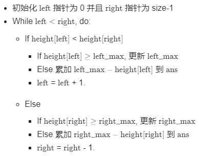

#### [41. 缺失的第一个正数](https://leetcode-cn.com/problems/first-missing-positive/)

难度困难

给你一个未排序的整数数组，请你找出其中没有出现的最小的正整数。

 

**示例 1:**

```
输入: [1,2,0]
输出: 3
```

**示例 2:**

```
输入: [3,4,-1,1]
输出: 2
```

**示例 3:**

```
输入: [7,8,9,11,12]
输出: 1
```

 

**提示：**

你的算法的时间复杂度应为O(*n*)，并且只能使用常数级别的额外空间。

**思路:**

​	这道题乍一看不难，把数组放在哈希表里面，然后循环`[1, n+1]`是否在哈希表里即可，两个要点：1.答案只可能再`[1, n+1]`，2.在哈希表里查找时间复杂度是O(1), 但是空间复杂度为O(n), 不满足题目要求。这提示了一个思路，我们把数组本身构造成一个哈希表，首先把负数和大于n的数字变成1，然后挨个查，比如第一个数字是5，为了标记5出现过了， 我们可以把第五个数变成负数，这样一来最后我们查找第一个正数的位置+1就是答案，如果全部是负数了，那就返回 `n+1`

**代码：**

```python
class Solution:
    def firstMissingPositive(self, nums: List[int]) -> int:
        n = len(nums)
        
        if 1 not in nums:
            return 1
        for i in range(n):
            if nums[i]<=0 or nums[i]>n:
                nums[i]=1
        for i in range(n):
            a = abs(nums[i])
            nums[a-1] = -abs(nums[a-1])
        for i in range(n):
            if nums[i]>0:
                return i+1
        return n+1
```


#### [42. 接雨水](https://leetcode-cn.com/problems/trapping-rain-water/)

难度困难

给定 *n* 个非负整数表示每个宽度为 1 的柱子的高度图，计算按此排列的柱子，下雨之后能接多少雨水。

 

**示例 1：**


```
输入：height = [0,1,0,2,1,0,1,3,2,1,2,1]
输出：6
解释：上面是由数组 [0,1,0,2,1,0,1,3,2,1,2,1] 表示的高度图，在这种情况下，可以接 6 个单位的雨水（蓝色部分表示雨水）。 
```

**示例 2：**

```
输入：height = [4,2,0,3,2,5]
输出：9
```

 

**提示：**

- `n == height.length`
- `0 <= n <= 3 * 104`
- `0 <= height[i] <= 105`

**思路：**

​	这道题，首先想的就是暴力，但一看数组长度毫无疑问会超时。

​	对于数组中的每个元素，我们找出下雨后水能达到的最高位置，等于两边最大高度的较小值减去当前高度的值。

​	但在暴力的基础上我们可以进行优化，首先采用两个数组记下`left_max` 和 `right_max` ，这样时间复杂度`O(N)`, 但空间复杂度也是`O(N)`.

​	继续优化: 雨水的题肯定要想到用双指针啦~， 只要 `right_max}[i]>left_max[i]`, 积水高度将由`left_max`决定，类似地，如果`left_max[i]>right_max[i]`，积水高度将由`right_max`决定，  。



**代码:**

```python
class Solution:
    def trap(self, height: List[int]) -> int:
        if not height:
            return 0
        n = len(height)
        leftmax = [0]*n
        rightmax = [0]*n
        leftmax[0]=height[0]
        for i in range(1,n):
            leftmax[i] = max(leftmax[i-1], height[i])
        rightmax[n-1]=height[n-1]
        for i in range(n-2,-1,-1):
            rightmax[i]=max(rightmax[i+1], height[i])
        ans = 0
        for j in range(1,n-1):
            ans+=(min(leftmax[j],rightmax[j])-height[j])
        return ans
```

双指针:

```python
class Solution:
    def trap(self, height: List[int]) -> int:
        if not height:
            return 0
        n = len(height)
        left, right = 0, n-1
        leftmax, rightmax = height[0], height[-1]
        ans = 0
        while(left<right):
            if height[left] < height[right]:
                if height[left] < leftmax:
                    ans+=(leftmax-height[left])
                else:
                    leftmax = height[left]
                left+=1
            else:
                if height[right] < rightmax:
                    ans+=(rightmax-height[right])
                else:
                    rightmax = height[right]
                right-=1
        return ans
```


