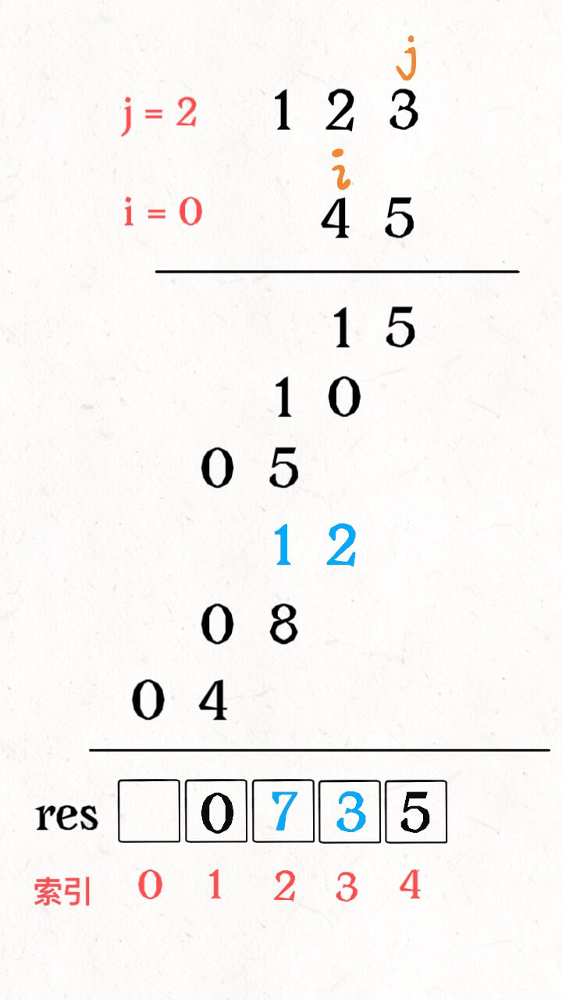

#### [43. 字符串相乘](https://leetcode-cn.com/problems/multiply-strings/)

难度中等

给定两个以字符串形式表示的非负整数 `num1` 和 `num2`，返回 `num1` 和 `num2` 的乘积，它们的乘积也表示为字符串形式。

**示例 1:**

```
输入: num1 = "2", num2 = "3"
输出: "6"
```

**示例 2:**

```
输入: num1 = "123", num2 = "456"
输出: "56088"
```

**说明：**

1. `num1` 和 `num2` 的长度小于110。
2. `num1` 和 `num2` 只包含数字 `0-9`。
3. `num1` 和 `num2` 均不以零开头，除非是数字 0 本身。
4. **不能使用任何标准库的大数类型（比如 BigInteger）**或**直接将输入转换为整数来处理**。

**思路：**



​	大数相乘，结果长度最多是两者长度之和，`num1[i]` 和 `num2[j]` 的乘积对应的就是 `res[i+j]` 和 `res[i+j+1]` 这两个位置。

**代码:**

```python
class Solution:
    def multiply(self, num1: str, num2: str) -> str:
        if num1=='0' or num2 =='0':
            return '0'
        m = len(num1)
        n = len(num2)
        res =[0]*(m+n)
        for i in range(m-1,-1,-1):
            for j in range(n-1,-1,-1):
                p1=i+j
                p2=i+j+1
                mul = int(num1[i])*int(num2[j])
                s = mul+res[p2]
                res[p2] = s % 10
                res[p1] += s//10
        for i in range(len(res)):
            if res[i]!=0:
                break
        anslist = res[i:]
        return ''.join([str(char) for char in anslist])

```


#### [44. 通配符匹配](https://leetcode-cn.com/problems/wildcard-matching/)

难度困难

给定一个字符串 (`s`) 和一个字符模式 (`p`) ，实现一个支持 `'?'` 和 `'*'` 的通配符匹配。

```
'?' 可以匹配任何单个字符。
'*' 可以匹配任意字符串（包括空字符串）。
```

两个字符串**完全匹配**才算匹配成功。

**说明:**

- `s` 可能为空，且只包含从 `a-z` 的小写字母。
- `p` 可能为空，且只包含从 `a-z` 的小写字母，以及字符 `?` 和 `*`。

**示例 1:**

```
输入:
s = "aa"
p = "a"
输出: false
解释: "a" 无法匹配 "aa" 整个字符串。
```

**示例 2:**

```
输入:
s = "aa"
p = "*"
输出: true
解释: '*' 可以匹配任意字符串。
```

**示例 3:**

```
输入:
s = "cb"
p = "?a"
输出: false
解释: '?' 可以匹配 'c', 但第二个 'a' 无法匹配 'b'。
```

**示例 4:**

```
输入:
s = "adceb"
p = "*a*b"
输出: true
解释: 第一个 '*' 可以匹配空字符串, 第二个 '*' 可以匹配字符串 "dce".
```

**示例 5:**

```
输入:
s = "acdcb"
p = "a*c?b"
输出: false
```

**思路：**

